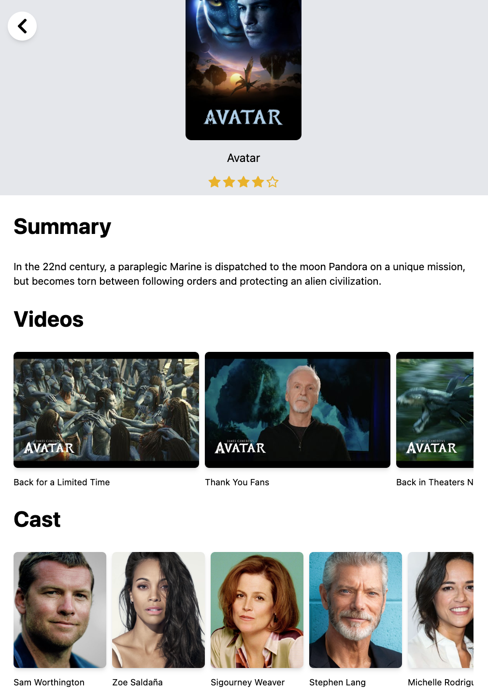
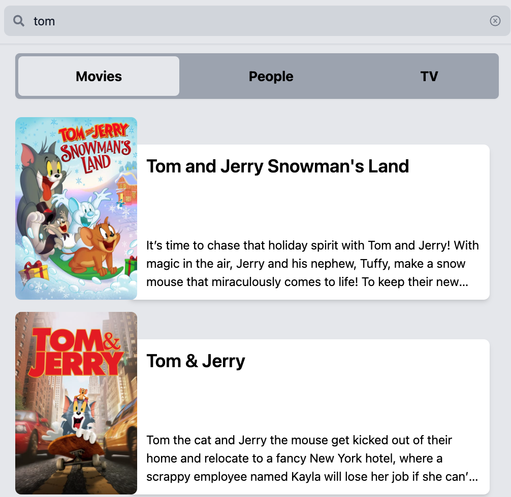
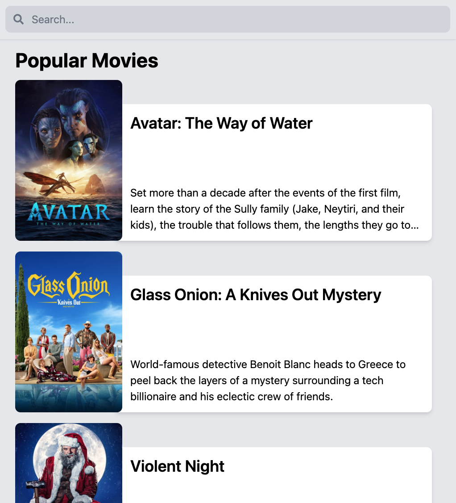
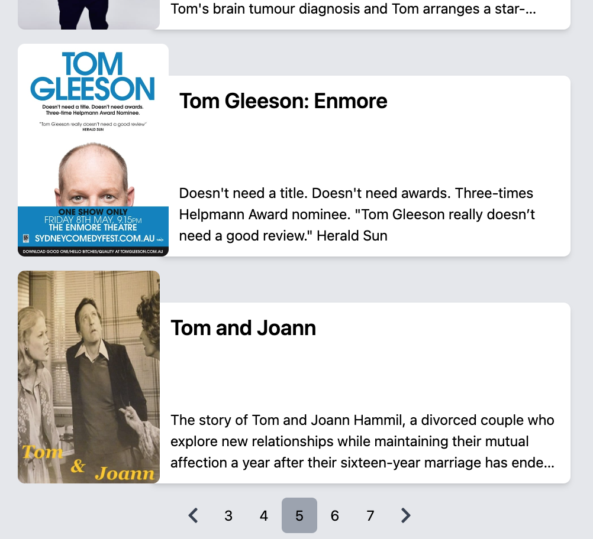
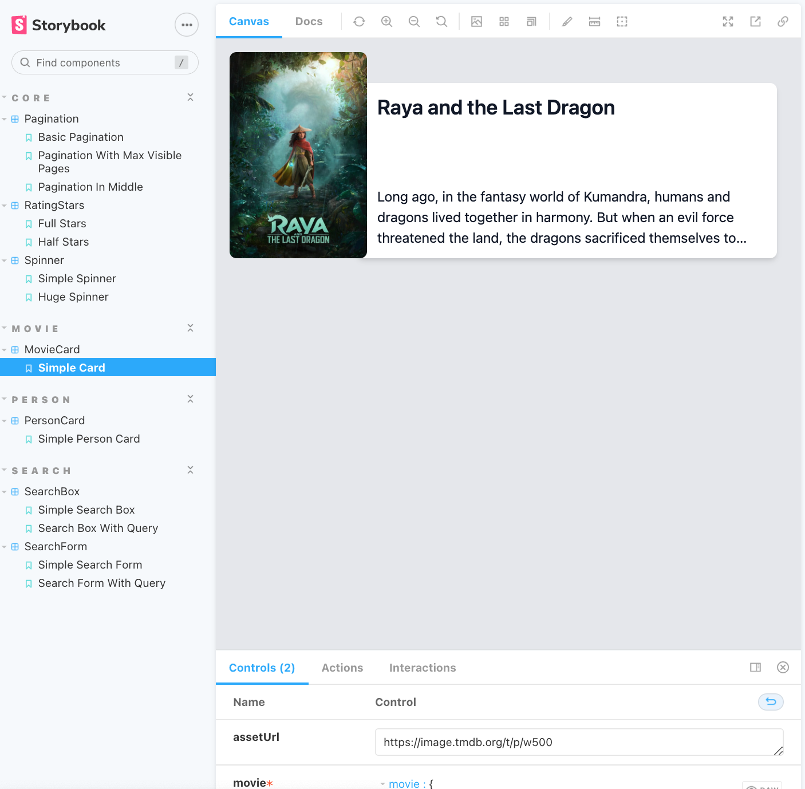

# Getting Started with Create React App

This is a simple app that uses [The Movie Database](https://www.themoviedb.org/) API to search for movies and shows.

You need an API key from [The Movie Database](https://www.themoviedb.org/). Create a file called `.env.local` in the root of the project and add the following line:

```env
REACT_APP_API_KEY=eyJ...your key here
```

Then you can run the app in development mode:

```sh
yarn start
```

Open [http://localhost:3000](http://localhost:3000) to view it in the browser.

## Screenshots











## Docker

There is a Dockerfile included in the project. You can build the image and run the container with the following commands:

```sh
docker build -t themoviedb .

## You can also use the .env.local file to set the API key
docker run --name themoviedb --env-file ./.env.local -it -p 3000:80 themoviedb
```

Open [http://localhost:3000](http://localhost:3000) to view it in the browser.

## Tests

There is a test suite included in the project. You can run the tests with the following command:

```sh
yarn test
```

Also, there is a storybook included in the project. You can run the storybook with the following command:

```sh
yarn storybook
```

## Used technologies

- [React](https://reactjs.org/)
- [React Router](https://reactrouter.com/)
- [Redux Toolkit](https://redux-toolkit.js.org/)
- [Tailwind CSS](https://tailwindcss.com/)
- [React Testing Library](https://testing-library.com/docs/react-testing-library/intro/)
- [Storybook](https://storybook.js.org/)
- [Docker](https://www.docker.com/)
- [Husky](https://typicode.github.io/husky/#/)
- [Commitlint](https://commitlint.js.org/#/)
- [Prettier](https://prettier.io/)
